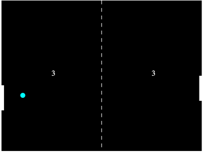
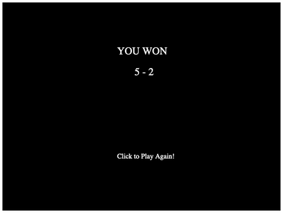

# pong-arcade-game
`pong-arcade-game` is a table tennis themed arcade video game made for fun. This game can be played using a web browser and is cross-browser compatible.

# Gameplay:
Gameplay is simple, we usually need two people to play this arcade game. But for this version of pong, one player is an AI bot. So you will be playing with a simple pong bot.
You own the left side of the arena and your aim is to send the ball back using the left side paddle. If you miss it, pong-bot gains a point. And if the bot misses the ball, you will get a point.

 

# Controls:
You need to use your mouse(or track-pad) to move your paddle up or down. The paddle moves accordingly with your mouse pointer. The mouse pointer needs to be on the arena to control your paddle.

# GameOver:
The game is for 5 points, whichever user reaches this many points first wins the game. A final result is show after GameOver. You can restart the game on clicking this GameOver screen.

 

# Built:
This game is built using plain vanilla Javascript and HTML5 Canvas. 
